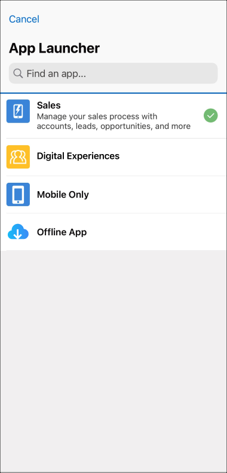

# Offline App Developer Starter Kit

The Offline App Developer Starter Kit provides instructions and sample code to get you up and running quickly with Lightning Web Components (LWC) Offline. This README provides steps to clone, modify, and deploy example offline components and quick actions, and view them in the offline-enabled version of the Salesforce Mobile app.

## Prerequisites

- The Salesforce product team will enable the following permissions for your organization during onboarding: 
  - `LightningWebRuntime`
  - `LightningSDK`
  - `Briefcase`
- Install Salesforce CLI:
  - Follow the steps in the [Salesforce CLI Setup Guide](https://developer.salesforce.com/docs/atlas.en-us.sfdx_setup.meta/sfdx_setup/sfdx_setup_intro.htm)
- Install Visual Studio Code and the Salesforce Extension Pack
  - [Visual Studio Code Download](https://code.visualstudio.com/download)
  - [Salesforce Extension Pack](https://marketplace.visualstudio.com/items?itemName=salesforce.salesforcedx-vscode)

### Set up Briefcase

1. Navigate to Briefcase Builder from Setup and click **New Briefcase**:
  

2. Follow the wizard to create a new Briefcase:
  

3. Select objects and filters to apply:
  

4. Set user assignments and complete the wizard. A new Briefcase is created:
  

## Set Up The Starter Kit Project

1. Clone this repository:  
  
   ```sh
   git clone https://github.com/salesforce/offline-app-developer-starter-kit.git
   ```

2. Open directory:

   ```sh
   cd offline-app-developer-starter-kit
   ```

3. Check out the appropriate tag. The tagged commits are properly tested, whereas the `HEAD` of the branch may not be ready for consumption.

4. Install dependencies:

   ```sh
   npm install
   ```

5. Authorize access to your org. Either Salesforce CLI or VS Code can be used for authorization and deployment. VS Code is recommended.

   - Authorize Salesforce from VS Code:

      - Enter the command palette in VSCode (CMD+SHIFT+P) and type `SFDX:Authorize an org`
        
      - A browser window opens with the Salesforce login screen. Log in to your org.

   - **Alternatively,** authorize Salesforce from CLI:

      ```sh
      sfdx auth:web:login -d -a AliasName
      ```

      - Login with your org credentials
      - **-d** sets this the default org with the CLI
      - **-a** sets an alias

      See also: [CLI Reference](https://developer.salesforce.com/docs/atlas.en-us.sfdx_cli_reference.meta/sfdx_cli_reference/cli_reference.htm)

## View and Modify Components and Quick Actions

Navigate to:

```sh
cd force-app/main/default
```

- `lwc/` directory contains example Lightning web component bundles:  
  
- `quickActions/` directory contains example Quick Actions:  
  

  For example: `Account.view.quickAction-meta.xml` contains metadata to describe a quick action:

  ```xml
  <?xml version="1.0" encoding="UTF-8"?>
  <QuickAction xmlns="http://soap.sforce.com/2006/04/metadata">
      <actionSubtype>ScreenAction</actionSubtype>
      <label>View</label>
      <lightningWebComponent>genericVisit</lightningWebComponent>
      <optionsCreateFeedItem>false</optionsCreateFeedItem>
      <type>LightningWebComponent</type>
  </QuickAction>
  ```

  The `<lightningWebComponent>` element specifies the Lightning web component loaded for
  the given quick action.

## Deploy Changes

Before you can run a changed component, you need to deploy it to your org. Changes made to components or quick actions can be deployed via the CLI or VS Code.

Using CLI:

```sh
sfdx force:source:deploy --sourcepath ./force-app/main/default
```

Using VS Code:

- Right-click on a component or Quick Action and select: `SFDX: Deploy Source to Org`  
  
- Upon successful deploy you will see in the console:  
  

> **Note**
> You might need to clear caches and quit the app and restart it before changes to LWCs are active.
## Add LWC Quick Actions to Mobile Layouts


For a quick action to appear in the action bar for a record view, it must be assigned to the main page layout for the record's object type.

Here's an example of assigning the Edit LWC quick action for an Account:

1. From Setup, open the Object Manager.
2. Enter `Account` in the Quick Find box, then select **Account**.
3. From the Account object management settings, go to **Page Layouts** and click **Account Layout**.
4. In the **Salesforce Mobile and Lightning Experience Actions** panel, if you see a link to **override the predefined actions**, the page layout is using the default actions. Click the link to enable customizing the actions.
5. Select **Mobile & Lightning Actions** in the palette.
6. Drag the **Edit (LWC)** quick action into the mobile section. Make it the first item.
7. _Optional:_ Reorganize the actions so frequently used actions are first, and remove any unnecessary actions.
8. Click **Save**.

> **Note**
> In a future release you will be able to assign quick actions per record type. For the time being, only actions on the main page layout are shown.

## View Offline Components in the Salesforce Mobile App

> **Note**
> The experience is identical across iOS and Android.

- Launch the mobile app:
  
- Tap **Download Offline Records**:
  
- Once primed, offline records are displayed in a list:
  
- To see the deployed component, tap an associated record:
  FIXME: Missing Image

## Call Apex Methods from Lightning Web Components

Apex methods can be called from Lightning web components. When developing for the Offline App, we highly encourage you to use base components and Lightning Data Service (LDS) via wire adapters for viewing or modifying data. Apex methods aren't available offline.

The Starter Kit provides an example of calling Apex from an LWC:

- `viewAccountsWithApex`: This component takes user input and calls the included `AccountController` Apex method for `getAccountList`. It can be accessed from an Account record quick action.
- The quick action is defined in `quickActions/Account.viewAccountsWithApex.quickAction-meta.xml`.
- This example uses additional utility components, `errorPanel` and `ldsUtils`, which are also included in the Starter Kit. They're useful, but not specific to offline features.

> **Note**
> End users must have access to the `AccountController` Apex class. If they don't, calls to the `getAccountList` Apex method will fail. See [How Does Apex Class Security Work?](https://help.salesforce.com/s/articleView?id=sf.code_package_security.htm&type=5) for more information.

The above components have been adapted from the [lwc-recipes repository](https://github.com/trailheadapps/lwc-recipes). For further information about calling Apex from LWCs, such as calling methods with complex parameters, see [Wire Apex Methods to Lightning Web Components](https://developer.salesforce.com/docs/component-library/documentation/en/lwc/lwc.apex_wire_method) in the _Lightning Web Components Developer Guide._

## Current Limitations

- The Offline App mobile build is required to view deployed components.
