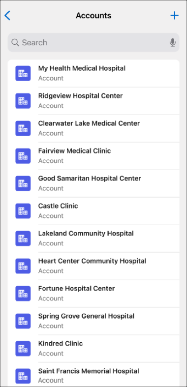

# Offline App Developer Starter Kit

The Offline App Developer Starter Kit — this repository — is your jump start to get up and running quickly with Lightning Web Components and Mobile Offline. This README provides steps to clone, modify, and deploy example offline components and quick actions, and view them in the offline-enabled version of the Salesforce Mobile app.

## How to Use the Starter Kit

Getting started with the Starter Kit is straightforward, but does require a few steps.

* Install prerequisite developer tools
* Configure a Briefcase for offline priming
* Make a copy of the Starter Kit project, and configure it for your org
* Deploy the Starter Kit code to your development org
* Add quick actions included in the Starter Kit to your record page layouts
* Access the Offline App from the Salesforce Mobile app and see the code in action!

The remainder of this README is intended to guide you through these steps. The instructions provided are specific to getting started with the Starter Kit, **not** complete documentation. For additional details of developing with Lightning Web Components and offline development, see the following developer guides:

* [Lightning Web Components Developer Guide](https://developer.salesforce.com/docs/component-library/documentation/en/lwc)
* [Mobile and Offline Developer Guide](https://developer.salesforce.com/docs/atlas.en-us.mobile_offline.meta/mobile_offline/)

## Prerequisites

The Salesforce product team will enable your org for Mobile Offline when you license it. While you wait, perform the following tasks to set up your developer environment and tools, so you can begin exploring once Mobile Offline is enabled.

* Install Salesforce CLI
  * Follow the steps in the [Salesforce CLI Setup Guide](https://developer.salesforce.com/docs/atlas.en-us.sfdx_setup.meta/sfdx_setup/sfdx_setup_intro.htm)
* Install Visual Studio Code and the Salesforce Extension Pack
  * [Visual Studio Code Download](https://code.visualstudio.com/download)
  * [Salesforce Extension Pack](https://marketplace.visualstudio.com/items?itemName=salesforce.salesforcedx-vscode)

Instructions for installing and using additional tools specific for mobile and offline development are available in the "[Development Tools and Processes](https://developer.salesforce.com/docs/atlas.en-us.mobile_offline.meta/mobile_offline/dx.htm)" chapter of the _Mobile and Offline Developer Guide._

## Quick Start Guide

Here's a list of steps to ensure you can view a custom record type offline. Each link provides more details on the specific step. For records in the starter kit, you can use the corresponding existing LWC and modify it to your needs.

* Set up your development environment, following the [Starter Kit Guide](https://github.com/salesforce/offline-app-developer-starter-kit#prerequisites) prerequisites step.
* Set up the [starter kit project](https://trailhead.salesforce.com/trailblazer-community/feed/0D54V000078RAEVSA4#:~:text=Add%20your%20QuickAction).
* Configure your [Offline Briefcase](https://github.com/salesforce/offline-app-developer-starter-kit#define-an-offline-briefcase) to include the object you want to see offline.
  * Use the [Offline Briefcase](https://trailhead.salesforce.com/content/learn/modules/offline-briefcase) trailhead to learn more, including how to view a briefcase as a specific user to ensure that they are seeing the records you expect them to.
 
Status Check: Following the [instructions here](https://github.com/salesforce/offline-app-developer-starter-kit#view-offline-components-in-the-salesforce-mobile-app), are you seeing the object you want offline in this screen? If not, check your Briefcase. If you attempt to view the record, you will get an error that the records for that object type are not configured for offline, which is expected at this point. Note: In newer builds you will see an error on the "My Offline Records" screen on the row with the objects not yet configured.

* Create a lightning web component using SFDX: Create Lightning Web Component. Name it something like "`viewObjectType`". Replace "`ObjectType`" with the Object Name you're trying to display, such as "`viewWorkOrder`".
  * If you are unfamiliar with developing Lightning Web Components, the [Building Lightning Web Components trailhead](https://trailhead.salesforce.com/content/learn/trails/build-lightning-web-components) is a great resource for building and testing Lightning Web Components. Your LWC should work online in the browser before deploying it to mobile.
* Have your Lightning Web Component render your custom object. If you need a starting point:
  * Use the [viewAccountRecord starter kit](https://github.com/salesforce/offline-app-developer-starter-kit/tree/main/force-app/main/default/lwc/viewAccountRecord) as an example. Copy the content of the `.js`, .`html`, `.xml`, and `.css` files into your new component's files
  * Change your `viewObjectType.js` file as follows:
    * Change the class name "export default class ViewAccountRecord" to your Component's name, i.e. "export default class ViewObjectType"
    * Leave the imports from "lwc" and "lightning/uiRecordAPI"
    * Delete all the field imports for Account
    * Create new `import FIELD_NAME from "@salesforce/schema/ObjectType.Field";` lines for the relevant fields you are interested in. Replace FIELD_NAME, ObjectType and Field with appropriate values. 
    * Adjust the `fields()` and `name()` methods to return the fields you wish.
* `viewObjectType.html` requires no modification.
  * Note that this view depends on the [draftDetails custom component](https://github.com/salesforce/offline-app-developer-starter-kit/tree/main/force-app/main/default/lwc/draftDetailsList) that is part of the starter kit. As long as you are working from the starter kit and deploy that to your org, this will be fine. If not, you may get an error that the 'c-draft-details' component doesn't exist when you attempt to push this component.
* Change `viewObjectType.js-meta.xml` as follows:
  * Change `<masterLabel>` and `<description>`. All other fields can remain the same.
* `viewObjectType.css` requires no modification.
  * `commonStyles` is part of the starter kit.
* Create a quick action to view your object. This quick action requires a specific format: <ObjectType>.view.quickAction-meta.xml. Note the lowercase 'view', as that is required. Follow the [Account.view](https://github.com/salesforce/offline-app-developer-starter-kit/blob/main/force-app/main/default/quickActions/Account.view.quickAction-meta.xml) example but change the `<lightningWebComponent>` to the component you created in the previous step.
* Deploy the Starter Kit, your custom viewObjectType LWC folder, and `ObjectType.view.quickAction-meta.xml` files to your org. The Building Lightning Web Component trailhead goes into more details on this, we also have a [short guide in the starter kit](https://trailhead.salesforce.com/trailblazer-community/feed/0D54V000078RAEVSA4#:~:text=short%20guide%20in%20the%20starter%20kit).
* [Add your QuickAction](https://trailhead.salesforce.com/trailblazer-community/feed/0D54V000078RAEVSA4#:~:text=Add%20your%20QuickAction) to the Mobile Layout for the user.

In the mobile app, logout and login to reload your cache. If you have a new build, use the Clear Cached Data button in the settings screen. Follow the steps above again and view a record online. Your should see your custom Lightning Web Component! If priming has completed, go offline (turn on Airplane Mode and turn off Wifi) and view a record you haven't viewed while online, and ensure your view component succeeds there as well.

You have now created a successful '.view' Quick Action to prime and view this Object offline! Other special action types for required functionality include '.edit' and '.create' for their respective actions (the capitalization and naming is important for these as well). The Starter Kit contains examples for these actions as well. Any other custom Lightning Web Component Quick Actions you create that are offline capable will show up in the Action Bar of the '.view' action once they are added to the Mobile Layout as in Step 5.

### Other custom actions

Other lightning web component quick actions can be [added to the object's page layout](https://trailhead.salesforce.com/trailblazer-community/feed/0D54V000078RAEVSA4#:~:text=Add%20your%20QuickAction) as listed below in this guide, and will be accessible at the top of the view quick action. Salesforce reserves 3 quick action names for specific use cases, create custom LWCs assigned to these quick action names to enable this functionality:

* `<ObjectName>.view.quickAction-meta.xml` is used for viewing a record and injects an action bar across the top for other quick actions.
* `<ObjectName>.edit.quickAction-meta.xml` is used for editing a record including its drafts.
* `<ObjectName.create.quickAction-meta.xml` is used for creating a new record from the plus button in My Offline Records.

Note that these quick action names require the exact capitalization and spelling.

## Define an Offline Briefcase

The _Briefcase_ is the most fundamental and powerful method for defining the set of records that your offline users can take with them when they're in the field, away from a network connection. A Briefcase is actually quite simple; it's just a set of rules and filters that select records. The Offline App uses — and depends on — a Briefcase to use when priming records for offline use.

1. From Setup, navigate to Briefcase Builder and click **New Briefcase**:
  

2. Follow the wizard to create a new Briefcase:
  

3. Select objects and filters to apply:
  

4. Set user assignments and complete the wizard. A new Briefcase is created:
  

For additional details about how to create a briefcase for offline use, see "[Briefcase Builder](https://help.salesforce.com/s/articleView?id=sf.briefcase_builder_overview.htm&type=5)" in the Salesforce Help.

## Set Up the Starter Kit Project

To use the Starter Kit, first clone (copy) it to your development system, and then configure it to connect to a Salesforce org you want to use for development. The easiest way to accomplish this is using the command line.

1. In Terminal, or your command line application of choice, create or move to a directory where you want to copy the Starter Kit. For example:

   ```sh
   mkdir -p ~/Developer/Salesforce
   cd ~/Developer/Salesforce
   ```

2. Clone this repository:  
  
   ```sh
   git clone https://github.com/salesforce/offline-app-developer-starter-kit.git
   ```

3. Move into the repo directory:

   ```sh
   cd offline-app-developer-starter-kit
   ```

4. Check out an appropriate (recent) [tagged release of the Starter Kit](https://github.com/salesforce/offline-app-developer-starter-kit/tags). For example:
  
   ```sh
   git tag -l
     v242.0.0
     v242.1.0
     v242.2.0
     v242.3.0
   git checkout v242.3.0
   ```
  
   Tagged commits have gone through more complete testing, whereas the `HEAD` of the MAIN branch might not be ready for consumption.  
  
5. Install dependencies:
  
   ```sh
   npm install
   ```

6. Authorize access to your org. Either Salesforce CLI or VS Code can be used for authorization and deployment.
  
   * Authorize Salesforce from VS Code:

      * Enter the command palette in VS Code (CMD+SHIFT+P) and type `SFDX:Authorize an org`
        
      * A browser window opens with the Salesforce login screen. Log in to your org.

   * **Alternatively,** authorize Salesforce from CLI:

      ```sh
      sfdx auth:web:login -d -a AliasName
      ```

      * Log in with your org credentials
      * **-d** sets this as the default org with the CLI
      * **-a** sets an alias for this org

      For extensive details about using Salesforce CLI, see the [CLI Reference](https://developer.salesforce.com/docs/atlas.en-us.sfdx_cli_reference.meta/sfdx_cli_reference/cli_reference.htm).

## Deploy Components and Quick Actions

Before you can run a quick action based on a Lightning web component, you need to deploy the relevant code artifacts to your org. Components and quick actions can be deployed via the CLI or VS Code.

Using CLI:

```sh
sfdx force:source:deploy --sourcepath ./force-app/main/default
```

Using VS Code:

* Right-click on a component or Quick Action and select: `SFDX: Deploy Source to Org`  
  
* Upon successful deploy you will see in the console:  
  

> **Note**
> You might need to clear caches and quit the app and restart it before changes to LWCs are active.

## Add LWC Quick Actions to Mobile Layouts


For a quick action to appear in the action bar of a record view, it must be assigned to the main page layout for the record's object type.

Here's an example of assigning the **Edit** quick action for the Account object type:

1. From Setup, open the Object Manager.
2. Enter `Account` in the Quick Find box, then select **Account**.
3. From the Account object management settings, go to **Page Layouts** and click **Account Layout**.
4. In the **Salesforce Mobile and Lightning Experience Actions** panel, if you see a link to **override the predefined actions**, the page layout is using the default actions. Click the link to enable customizing the actions.
5. Select **Mobile & Lightning Actions** in the palette.
6. Drag the **Edit (LWC)** quick action into the mobile section. Make it the first item.
7. _Optional:_ Reorganize the actions so frequently used actions are first, and remove any unnecessary actions.
8. Click **Save**.

> **Note**
> At this time, only actions added to the main page layout are accessible in the Offline App. Support for record types will be available in a future release.

## View Offline Components in the Salesforce Mobile App

The part you've been waiting for: seeing the code in action!

> **Note**
> The iOS version is used here, but the experience is identical across iOS and Android.


- Launch the Offline App:

  

- Tap on **My Offline Records**:

  

- Offline Briefcase records:

  

- Records:

  

## Modify Existing and Create New Components

Here's where it gets fun: making changes and seeing how they run. Once you've verified that you can view and use the quick actions provided in the Starter Kit, it's time to make them your own. Here are a couple of quick notes to help you find your way.

### View and Modify Components and Quick Actions

Starter Kit examples consist of a number of LWC components, and a set of quick action definitions that use them. You'll find this code in two directories in the Starter Kit.

Navigate to:

```sh
cd force-app/main/default
```

* `lwc/` directory contains example Lightning web component bundles:  
  

  For example, `lwc/editAccountRecord/` contains the files that make up the `editAccountRecord` component.
* `quickActions/` directory contains example Quick Actions:  
  

  For example: `Account.edit.quickAction-meta.xml` contains metadata to describe a quick action:

  ```xml
  <?xml version="1.0" encoding="UTF-8"?>
  <QuickAction xmlns="http://soap.sforce.com/2006/04/metadata">
      <actionSubtype>ScreenAction</actionSubtype>
      <label>Edit</label>
      <lightningWebComponent>editAccountRecord</lightningWebComponent>
      <optionsCreateFeedItem>false</optionsCreateFeedItem>
      <type>LightningWebComponent</type>
      <icon>editActionIcon</icon>
  </QuickAction>
  ```

  The `<lightningWebComponent>` element specifies the Lightning web component loaded for
  the given quick action. In this case, the `editAccountRecord` component.

### View Draft Details within a Lightning Web Component

It may be useful to view draft details within a record view Lightning Web Component for debugging purposes. To enable draft details, simply uncomment the `<c-draft-detailst-list>` component from the `view<Object>Record` component html. Don't forget to uncomment the respective test code to validate the expected behavior.

> **Note**
> Adding additional dependencies will negatively affect the total time to prime all records, as well as slightly increase single record load times. It is recommended to remove or comment out debug components such as `<c-draft-details-list>` from production code.

### Call Apex Methods from Lightning Web Components

Apex methods can be called from Lightning web components. However, Apex is a server-side language, and Apex methods aren't available when offline. When developing for the Offline App, we recommend that you use base components and Lightning Data Service (LDS) via wire adapters for viewing or modifying data. See "[Data Guidelines](https://developer.salesforce.com/docs/component-library/documentation/en/lwc/lwc.data_guidelines)" for a more detailed description of recommended strategies for data access within LWCs.

The Starter Kit provides an example of calling Apex from an LWC:

* `viewAccountsWithApex`: This component takes user input and calls the included `AccountController` Apex method for `getAccountList`. It can be accessed from an Account record quick action.
* The quick action is defined in `quickActions/Account.viewAccountsWithApex.quickAction-meta.xml`.
* This example uses additional utility components, `errorPanel` and `ldsUtils`, which are also included in the Starter Kit. They're useful, but not specific to offline features.

> **Note**
> To run this component, you must have access to the `AccountController` Apex class. If you don't, calls to the `getAccountList` Apex method will fail. See [How Does Apex Class Security Work?](https://help.salesforce.com/s/articleView?id=sf.code_package_security.htm&type=5) for more information.

For additional details regarding using Apex in offline-ready apps, see "[Use Apex While Mobile and Offline](https://developer.salesforce.com/docs/atlas.en-us.mobile_offline.meta/mobile_offline/apex.htm)" in the _Mobile and Offline Developer Guide._
For further information about calling Apex from LWCs, such as calling methods with complex parameters, see "[Wire Apex Methods to Lightning Web Components](https://developer.salesforce.com/docs/component-library/documentation/en/lwc/lwc.apex_wire_method)" in the _Lightning Web Components Developer Guide._

## Example Features

- [Offline Lookups](docs/OfflineLookups.md)
- [Related Records](docs/RelatedRecords.md)
- [Barcode Scanner](docs/BarcodeScanner.md)
