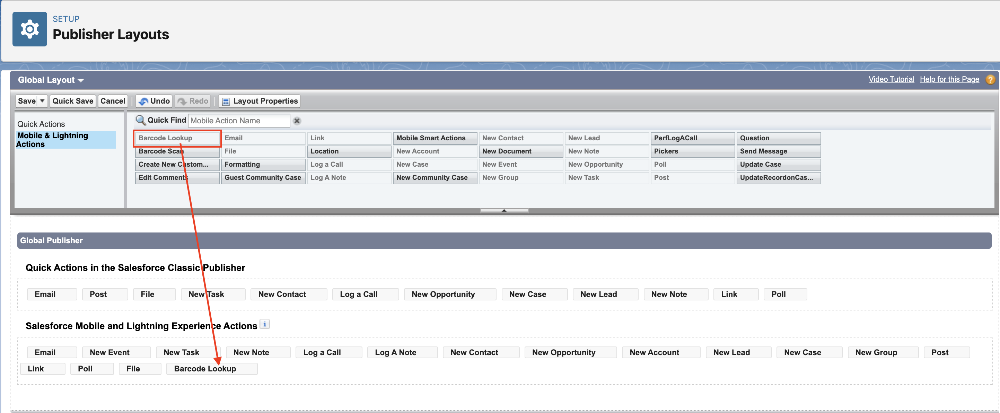
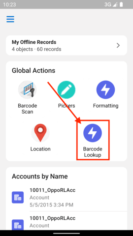

# Barcode Scanner

[The barcode scanner starter kit example](../force-app/main/default/lwc/scanBarcodeLookUp/) provides an LWC triggered from a global quick action on the landing page, for a user to scan a barcode and do a record lookup based on its value. Upon scanning the barcode of a supported type, the component does a GraphQL query on the returned value, to search the `Product` records with a matching barcode value, and displays the associated record to the user.

Note that records prefetched in the briefcase can be searched while the device is offline.

# How to Configure

1. [Configure your Offline Briefcase](../README.md#define-an-offline-briefcase) with the `Product` sObject.
2. Deploy the [`scanBarcodeLookUp`](../force-app/main/default/lwc/scanBarcodeLookUp) LWC, the [`viewProduct2Record`](../force-app/main/default/lwc/viewProduct2Record) LWC, and the [`Product2 view`](../force-app/main/default/quickActions/Product2.view.quickAction-meta.xml) quick action to your org.
3. There are two options for setting up the `scanBarcodeLookUp` LWC as a global quick action:
    - Go to Setup, select Global Actions and create a new Global Action with the `scanBarcodeLookUp` LWC. See [Create Global Quick Actions](https://help.salesforce.com/s/articleView?id=sf.creating_global_actions.htm&type=5) for more information on how to create LWC global quick actions from Setup.
    - Alternatively, you can deploy the `scanBarcodeLookUp` LWC as a quick action from your local Starter Kit project, by creating a new file within the `force-app/main/default/quickActions` folder that includes the following:

        ```xml
        <?xml version="1.0" encoding="UTF-8" ?>
        <QuickAction xmlns="http://soap.sforce.com/2006/04/metadata">
            <actionSubtype>ScreenAction</actionSubtype>
            <label>Barcode Lookup</label>
            <lightningWebComponent>scanBarcodeLookUp</lightningWebComponent>
            <optionsCreateFeedItem>false</optionsCreateFeedItem>
            <type>LightningWebComponent</type>
        </QuickAction>
        ```

4. Add the global action to publisher layout. 

    

5. In Setup, enter Static Resources in quick find and select Static Resources under Custom Code. Update the landing page json file by adding a global action in the actionList block and upload it.

```json
{
    "definition": "mcfp/actionItem",
    "name": "global_action",
    "label": "Scan barcode lookup",
    "properties": {
        "apiName": "Global.Barcode_Lookup"
    },
    "regions": {
    
    }
}
```

6. After setting up the `scanBarcodeLookUp` LWC, it can now be used as a Global Quick Action within the landing page. 

  

7. Clicking on the Barcode Lookup Global Quick Action, you will be expecting to see a screen with a Scan Barcode button.

> **Note**
> Only the prefetched records in briefcase can be searched when using this quick action in offline.

8. Click the Scan Barcode button and you will expect to see the camera preview. 

9. Use the camera to scan an EAN-13 barcode. Upon scanning the barcode, you should expect to see the `Product` record which has the `ProductCode` value equal to the barcode. If no product is found, an error screen is displayed.
